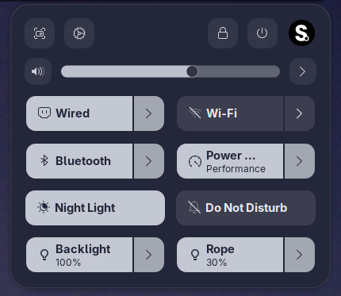
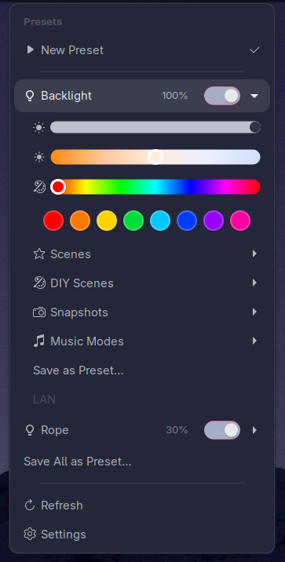
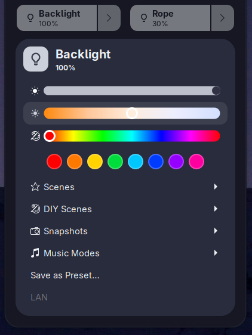
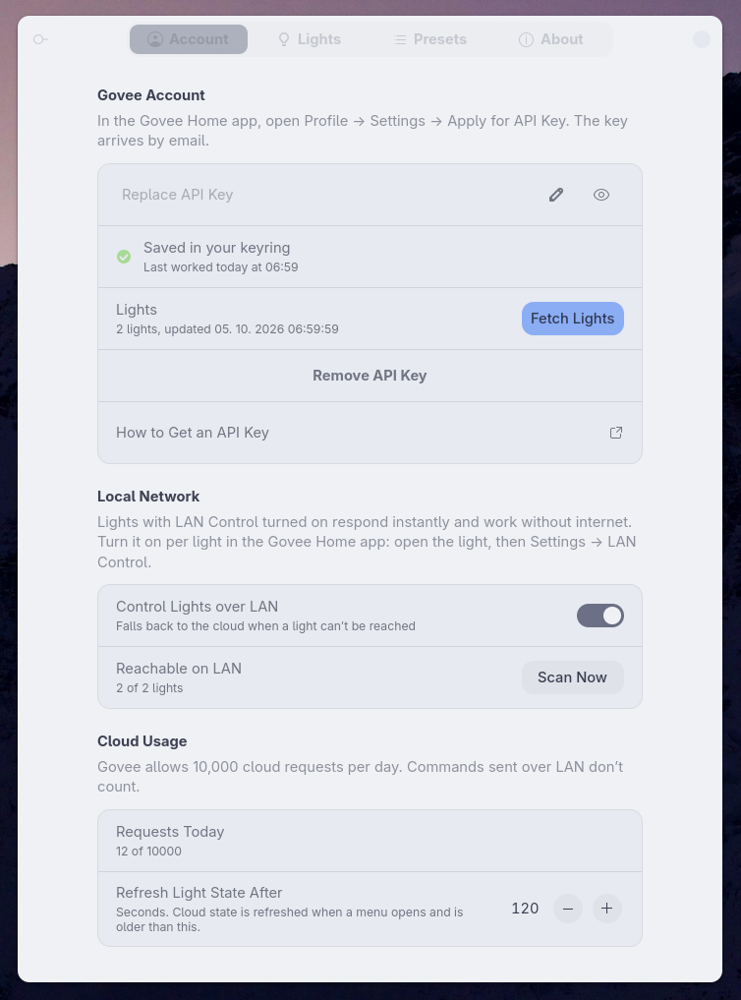
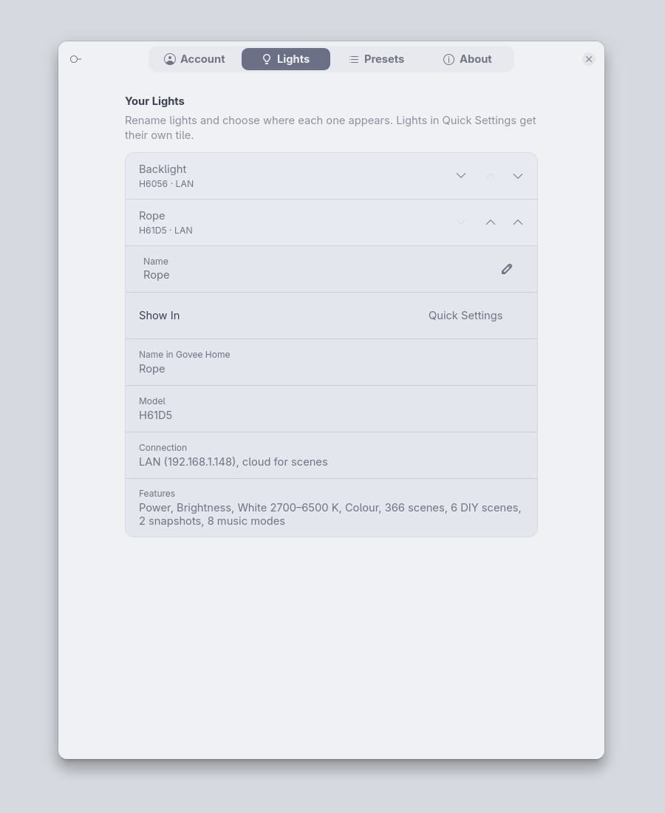
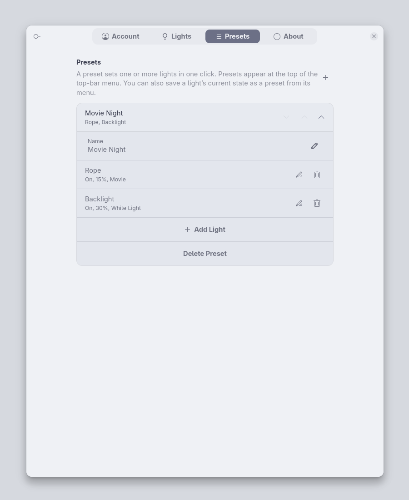

# LightsBuddy

**Control your Govee lights from the GNOME top bar or Quick Settings: instantly over your local network, with the Govee cloud as a fallback.**

[](https://release.gnome.org/50/)
[](LICENSE)
[](https://github.com/Svashtar/lightsbuddy-gnome/actions/workflows/ci.yml)

> **Status: early development.** There is no release yet. Follow the [changelog](CHANGELOG.md) for progress.

<p align="center">
  
  &nbsp;&nbsp;
  
</p>

## Introduction

LightsBuddy puts your Govee lamps, bulbs and strips where the rest of your desktop controls already are. Each light can sit in its own **Quick Settings tile** (next to Wi-Fi and Night Light) or in the extension's **top-bar menu**, and you choose which goes where.

Lights that have *LAN Control* enabled are driven directly over your local network, so sliders follow your finger live and nothing depends on the internet. Everything else (scenes, DIY scenes, snapshots, music modes and lights without LAN support) goes through the official Govee cloud API.

## Why?

- **There is no Govee app for Linux.** Without this extension, changing a light from your desk means reaching for your phone.
- **Local control is instant and private.** Commands sent over your LAN never pass through Govee's servers, and your lights keep working when the internet is down.
- **Your lights belong with your other controls.** They sit next to Wi-Fi, Bluetooth and Night Light, one click away, instead of in yet another app.

## Features

- **Quick Settings tiles.** Click the tile to toggle a light, open the arrow for its full controls. The subtitle shows brightness, the active scene or "Offline".
- **Top-bar menu.** One-click presets at the top, then a collapsible section per light with a power switch in its header, plus Refresh and Settings.
- **Choose where each light appears.** Hidden, top bar or Quick Settings, with your own names (aliases) and ordering.
- **Every control your light supports, and only those:**
  - power
  - brightness
  - colour temperature (using the light's own range)
  - colour: 8 quick swatches plus a rainbow hue slider
  - Govee scenes, DIY scenes, snapshots and music modes
- **Local (LAN) control first.** Lights with LAN Control are found automatically and respond in milliseconds, with no rate limit and no internet needed. The cloud is used only when it has to be.
- **Multi-light presets.** "Movie night" can dim two lamps and put the strip on a scene in one click. Presets apply to all their lights in parallel. Save the current state of a light as a preset straight from its menu.
- **Respects Govee's limits.** Cloud state is refreshed only when it is stale, and a daily request counter warns you before the 10,000 requests/day limit is reached.
- **Your API key stays in GNOME Keyring**, never in plain-text settings.
- **Helpful About page.** Release notes, links to the docs, settings export/import and a *Copy Debug Info* button for bug reports.

## Screenshots

<p align="center">
  
</p>

<p align="center">
  
  
  
</p>
<p align="center"><em>Settings: Account, Lights and Presets</em></p>

## Requirements

- **GNOME Shell 50.** Older versions are not supported.
- **A Govee API key** (free). See [Getting started](docs/getting-started.md) for how to request one.
- **GNOME Keyring** (or another Secret Service provider) to store the key. Standard on GNOME desktops.
- *Optional, but recommended:* **LAN Control** enabled for your lights in the Govee Home app, and UDP port 4002 open in your firewall. See [LAN control](docs/lan-control.md).

## Installation

### From extensions.gnome.org

*Coming soon.* Once the extension has been reviewed, it will be installable with one click from [extensions.gnome.org](https://extensions.gnome.org/) or the Extension Manager app.

### From a release zip

1. Download `lightsbuddy@svashta.com.shell-extension.zip` from the [latest release](https://github.com/Svashtar/lightsbuddy-gnome/releases/latest).
2. Install it:

   ```sh
   gnome-extensions install --force lightsbuddy@svashta.com.shell-extension.zip
   ```

3. Log out and back in (on Wayland GNOME Shell can't be restarted in place).
4. Enable it:

   ```sh
   gnome-extensions enable lightsbuddy@svashta.com
   ```

### From source

You need `git`, `make` and `glib-compile-schemas` (from the GLib development tools, usually already installed).

```sh
git clone https://github.com/Svashtar/lightsbuddy-gnome.git
cd lightsbuddy-gnome
make install
```

`make install` symlinks `src/` into `~/.local/share/gnome-shell/extensions/lightsbuddy@svashta.com`. Log out and back in, then run `gnome-extensions enable lightsbuddy@svashta.com`. To remove it again, run `make uninstall`.

## Quick start

1. **Add your API key.** Open the extension's settings (Extensions app → LightsBuddy → Settings), paste your Govee API key into **API Key** on the **Account** page and press Enter. The key is saved in your keyring and your lights are fetched straight away.
2. **Turn on LAN Control** for each light in the Govee Home app (device → settings → *LAN Control*). The Account page shows how many lights answer on your network under **Reachable on LAN**, for example "3 of 5 lights".
3. **Choose where each light appears.** On the **Lights** page, give each light a name and choose where it appears under **Show In**: *Top Bar Menu*, *Quick Settings* or *Hidden*.
4. *Optional:* create **presets** on the **Presets** page, or use *Save current as preset…* from a light's menu.

The full walk-through is in [Getting started](docs/getting-started.md).

## Documentation

| Guide | What it covers |
|---|---|
| [Getting started](docs/getting-started.md) | Getting an API key, first run, choosing where lights appear |
| [LAN control](docs/lan-control.md) | What LAN Control is, enabling it, firewall ports, Home Assistant |
| [Presets](docs/presets.md) | Multi-light presets, step by step |
| [Troubleshooting](docs/troubleshooting.md) | Offline lights, rate limits, bad keys, no LAN replies, collecting logs |
| [Privacy](docs/privacy.md) | What leaves your machine and where your key is stored |
| [Supported devices](docs/supported-devices.md) | Community list of tested models |
| [Architecture](docs/architecture.md) | How the extension is built (for contributors) |

## FAQ

**Do I need an internet connection?**
Only for the first setup (the device list comes from the Govee cloud) and for cloud-only features: scenes, DIY scenes, snapshots, music modes, and lights without LAN support. Power, brightness, colour and colour temperature work offline for lights with LAN Control.

**Why do some of my lights say "Cloud" instead of "LAN"?**
Either LAN Control is off for that light in the Govee Home app, the model doesn't support it, or your firewall is blocking replies on UDP port 4002. See [LAN control](docs/lan-control.md).

**Does it work alongside Home Assistant?**
Yes. The extension shares the LAN ports with other Govee integrations instead of taking them over. See [LAN control → Home Assistant](docs/lan-control.md#coexisting-with-home-assistant).

**Why isn't my light listed?**
The extension shows devices that the Govee cloud reports as lights. Plugs, sensors and other appliances are skipped.

**A control is missing for my light.**
Controls are shown only when the light reports that capability. If you think yours should have it, please open a [device report](https://github.com/Svashtar/lightsbuddy-gnome/issues/new?template=device_report.yml).

## Privacy

LightsBuddy has no telemetry and no servers of its own. The only things it talks to are your lights on the local network and the official Govee cloud API (`openapi.api.govee.com`). Your API key is stored in GNOME Keyring. Debug info never contains your API key or device IDs, and settings exports never contain your API key. Details are in [Privacy](docs/privacy.md).

## Contributing

Bug reports, device reports and pull requests are welcome. Please read [CONTRIBUTING.md](CONTRIBUTING.md) first. When reporting a bug, open **Settings → About → Copy Debug Info** and paste the result into the [bug report form](https://github.com/Svashtar/lightsbuddy-gnome/issues/new/choose).

## Translations

LightsBuddy is in English only. Every string is ready for gettext ([`po/lightsbuddy.pot`](po/lightsbuddy.pot)), so if you'd like it in your language, see [CONTRIBUTING.md → Translations](CONTRIBUTING.md#translations).

## License

LightsBuddy is free software, released under the [GNU General Public License, version 2 or later](LICENSE) (GPL-2.0-or-later).

## Disclaimer

Not affiliated with or endorsed by Govee. Govee is a trademark of its owner. This extension uses Govee's public developer API and LAN protocol.
